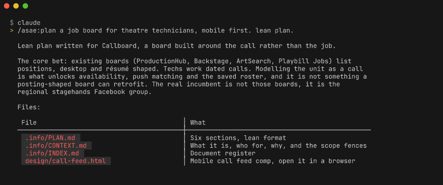
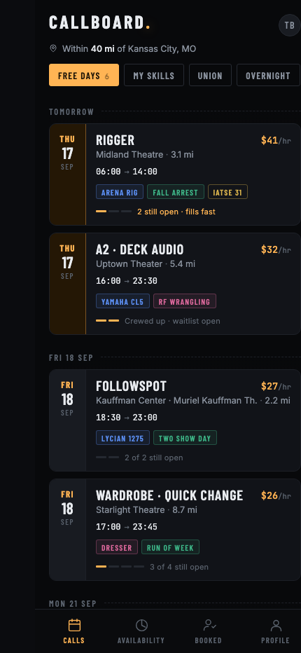
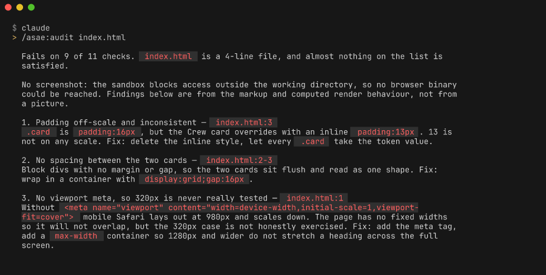
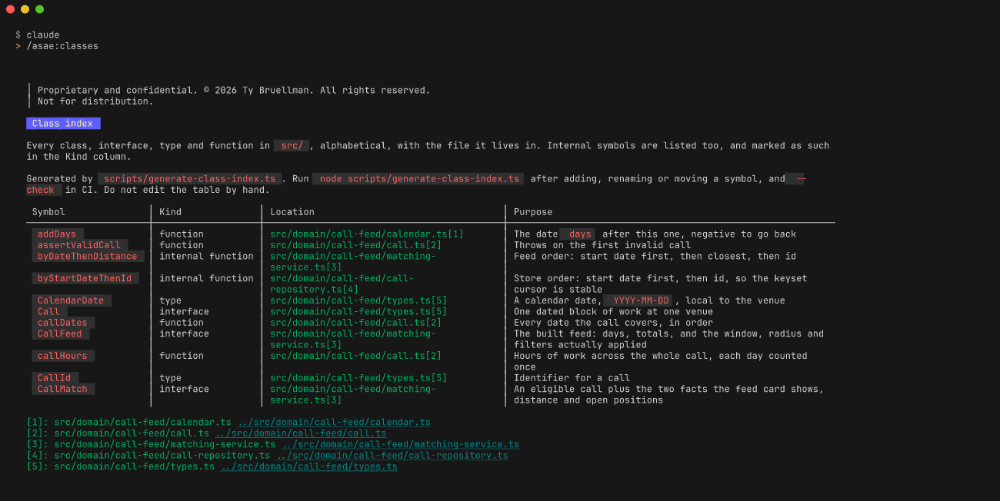
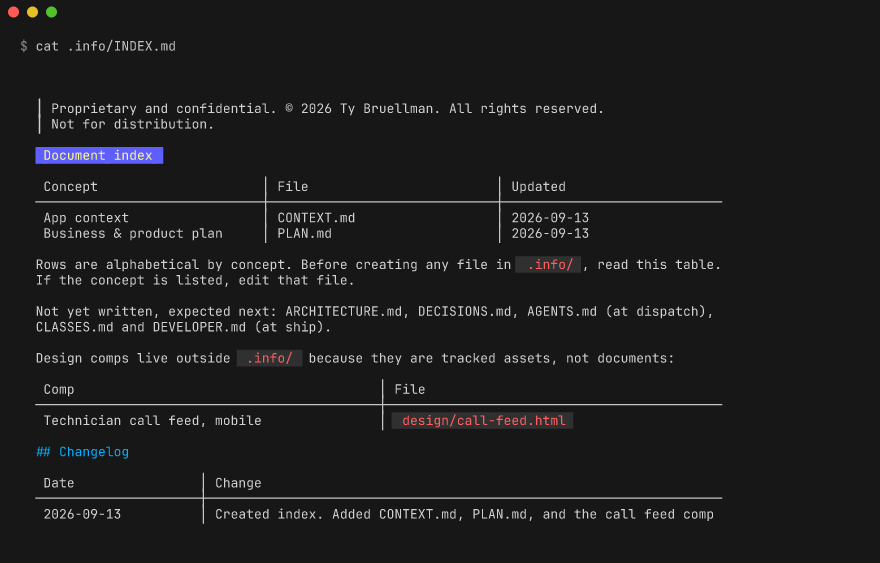
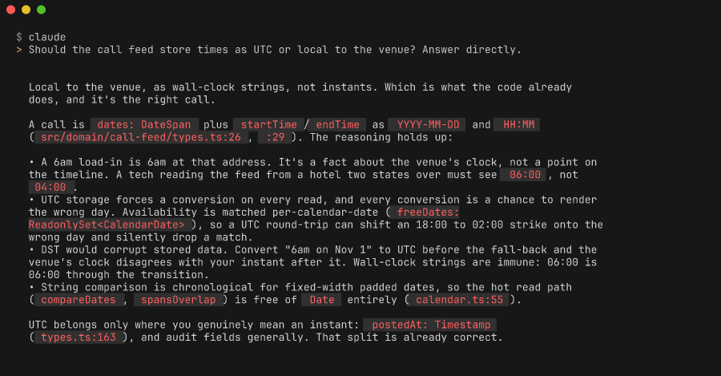

<h1 align="center">asae</h1>

<p align="center">
  
  
  
  
</p>

<p align="center"><strong>Agentic Solution Architecture Engineering</strong><br>
End-to-end software delivery under a fixed house standard.</p>

---

Sick of agents burying the lead on a question you asked directly?

Ever get an answer that is completely correct and completely unintelligible?

Ever spend an hour planning with an agent, only to get back something that looks
nothing like what you agreed?

Tired of AI slop: the same three rounded cards, the same purple gradient, the same
seventeen paragraphs where one sentence would do?

**This plugin is for you.**

Every answer opens with one bold line. Detail comes after, or behind a tap you choose.
Plans get written to a file and built from that file, so what ships is what you agreed to.
Screens face an audit before they merge. Padding, overlap, safe areas, missing states,
missing motion, plus a list of the exact tells that make generated interfaces look generated.

No em dashes. No en dashes. No filler. And nothing on screen that somebody made up.

---

## What it does

Runs a software project from idea to shipped: a six-section plan, architecture decisions,
subagent-driven implementation, tests, CI, developer documentation, and a class index,
while keeping chat replies short, bold-first, and free of buried detail.

The standard is opinionated on purpose:

- **Documentation lives in `.info/`**, gitignored, one document per concept, with a changelog in every file
- **A class index** (`.info/CLASSES.md`) maps every symbol to its file, alphabetically, so nobody hunts
- **Seven-section developer docs**: overview, quickstart, setup, guides, reference, troubleshooting, changelog
- **Commits credit the author**, never the assistant
- **No fake data, ever.** Mocks live in tests. If a feature needs a store, it asks for the connection or builds the schema, then renders a real empty state
- **Zero bugs, zero poor design**: padding, overlap, safe areas, missing states, and missing motion are defects
- **Nothing ships looking like stock AI output**

## Install

```
/plugin marketplace add CarsonEngineeringDesign/asae
/plugin install asae@asae
```

## Commands

| Command | Does |
|---|---|
| `/asae:plan` | Six-section plan into `.info/PLAN.md`, then shows the design direction |
| `/asae:dispatch` | Writes the master agent file and runs subagents on the next slice |
| `/asae:classes` | Rebuilds the alphabetical class index |
| `/asae:audit` | Zero-defect UI audit, padding, overlap, safe areas, states, motion, contrast |
| `/asae:ship` | Ship checklist, README pills, logo, dev docs, changelogs, runbook |

## Agents

| Agent | Does |
|---|---|
| `slice-reviewer` | Checks a completed slice against the definition of done and the house standard |
| `design-auditor` | Holds the visual quality bar; reports layout, state, motion, and distinctiveness failures |

## Skill

`agentic-solution-architecture-engineering` loads automatically for software work. It carries the
response contract and lifecycle, with detail in six reference files loaded only when the relevant
phase starts.

| Reference | Covers |
|---|---|
| `artifacts.md` | `.info/` layout, document index, pills, logo, proprietary notice |
| `ci-and-quality.md` | Pipeline stages, test strategy, definition of done, git hygiene |
| `design-standard.md` | Zero-defect bar, spacing, safe areas, motion, anti-generic rules |
| `developer-docs.md` | Seven-section developer docs, class index, folder conventions |
| `orchestration.md` | Subagent dispatch from a single master file |
| `planning.md` | Six-section plan structure, benchmark sourcing, margin honesty |

## Examples

Every screenshot below is real output from a real run against a throwaway project.
Nothing here is mocked up.

### Plan a project from one sentence

```
/asae:plan a job board for theatre technicians, mobile first. lean plan.
```



Writes the six sections to `.info/PLAN.md`, plus a context document and a document index,
and reports back with paths rather than pasting the plan into chat. Note what it refused to
do: every market and cost figure came back labelled `[TODO verify]` instead of filled in,
because no research tool was available in that session and a recalled price sitting next to
a real one poisons both.

### Get a design direction, not a slide about one

The same run produced a mobile comp you can open in a browser.

<p align="center"></p>

The anti-generic rules are doing visible work here. No purple gradient, no row of identical
rounded cards, no stock hero. The surface is near black because a white phone screen backstage
during a show is a real problem, and the one bright value is a warm running-light amber taken
from the subject matter. Dates, rates and call times come from the domain, not from filler.

### Audit a screen before it ships

```
/asae:audit index.html
```



`design-auditor` reports pass or fail with evidence and a file line for each finding: padding
off a spacing scale, contrast computed at both ends of a gradient, missing viewport meta,
ignored safe areas, undesigned empty states, and the named generic-AI tells. It reports and
never edits, so you get a list you act on.

### Keep a class index nobody has to hunt through

```
/asae:classes
```



Every class, interface, type and function in `src/`, strictly alphabetical, each linked to the
file it lives in. Internal helpers are indexed too and marked in the Kind column, because
hunting for an internal symbol is the same problem as hunting for a public one. The run above
indexed 79 symbols and wrote a generator plus a `--check` mode so CI fails when the table
drifts from the code.

### Every document carries its own changelog



`.info/INDEX.md` is the register: one row per concept, so a second plan document never gets
created by accident. Each document opens with the proprietary notice and closes with a dated
changelog table, including the index itself. When you come back in three months, the file
tells you what changed and when without a `git log` archaeology session.

### Answers that lead with the answer

```
Should the call feed store times as UTC or local to the venue? Answer directly.
```



The first line answers the question. Evidence, file references and the one gap worth closing
come after it. No preamble, no restating the question, no burying the verdict under four
paragraphs of context.

The no-dash rule is enforced by a Stop hook rather than by asking nicely. Measured over real
runs, instructions alone left em dashes in roughly half of replies. The hook reads the finished
reply, and asks for a rewrite when it finds one. The same question answered with 2 em dashes
before the hook and 0 after.

### Ask in plain language, no command needed

```
add password reset to the auth flow and get it production ready
```

The skill activates on its own for software work. Small requests get the same authorship and
response rules as large ones: a bold opening line that answers the question, detail after it,
documents written to `.info/` with a path in chat, and a commit that credits you.

## Response style

Answers open with one bold line. Detail comes after, or behind a tap. Documents go to files and
chat gets a path, so a heavy process never produces a heavy conversation.

## Requirements

Claude Code v2.x, and `python3` for the dash hook, which is optional and fails open. No MCP servers, no network calls, no third-party software installed.

## Security

No MCP servers, no network calls, no telemetry. One local shell script,
`hooks/no-dashes.sh`, runs when a reply finishes and asks for a rewrite if it finds a
dash. `design-auditor` runs with read tools only. `slice-reviewer` also gets `Bash` so
it can run your test suite. See [SECURITY.md](SECURITY.md).

## Support

Questions, bug reports, and feature requests: open an issue on this repository,
or email info@carsonengi.com.

Security problems go through the private channel in [SECURITY.md](SECURITY.md),
not the issue tracker.

## License

Free to install and use, at work or at home, on paid projects. You may not change it,
pass it on, or list it in another marketplace. Full terms in [LICENSE](LICENSE), written
in plain language and short enough to read.
